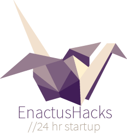

<p align="center">
  
</p>

# Western's EnactusHacks Website

A NodeJs + Express + MongoDB powered website for registration, application, processing and checking-in of participants to the 2020 [EnactusHacks' Hackathon](http://enactushacks.com).

## Running Locally

Make sure you have [Node.js](http://nodejs.org/) and [Docker](https://www.docker.com/) installed.

```sh
git clone https://github.com/jeffstjean/enactushacks-website # or clone your own fork
cd enactushacks-website/src
npm install
cd ..
cp sample.env .env # fill in the .env file with your values
docker-compose up
```

Your app should now be running on [localhost:3000](http://localhost:3000/) (or whatever port you specified). Edit same some changes in server.js and watch Nodemon automatically restart the server.

#### Notes

 - The Mongo container will start up first and run through all boot procedures before the nodejs application attempts to connect.
 - The MONGO_NAME and SITE_NAME as well as relevant ports must be unused and free.
 - The Mongo port is opened up to allow for admin access with an app like [Compass](https://www.mongodb.com/products/compass).


## Deploying for Production

The steps for deploying to production are very similar, however the docker-compose command is run with different yml files. You also do not need to install node modules because the production image will take care of bundling the code.

Make sure you have [Node.js](http://nodejs.org/) and [Docker](https://www.docker.com/) installed.

```sh
git clone https://github.com/jeffstjean/enactushacks-website # or clone your own fork
cd enactushacks-website
cp sample.env .env # fill in the .env file with your values
docker-compose -f docker-compose.yml -f docker-compose.prod.yml up
```

#### Notes

 - The application will be injected with the PRODUCTION environment variable so no stacktraces will be end-user visible (see [other benefits](https://dzone.com/articles/what-you-should-know-about-node-env) of PRODUCTION)
